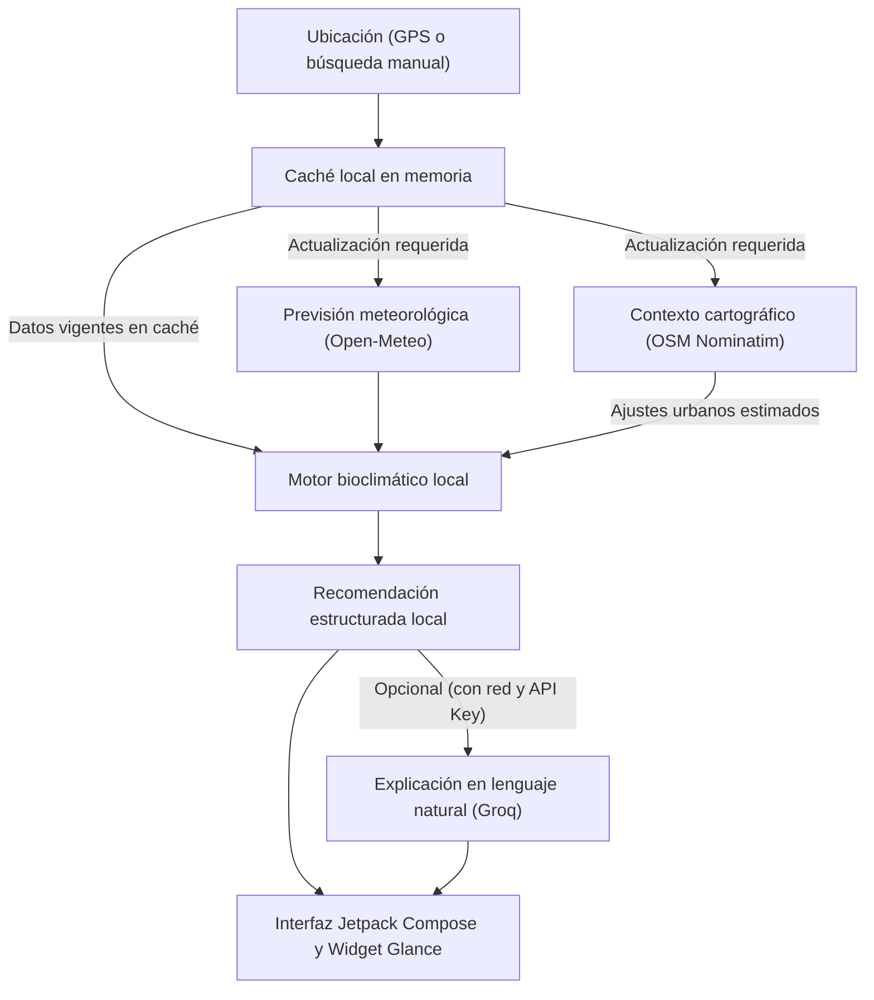

# Easy-Climate

Easy-Climate es una aplicación Android que genera recomendaciones orientativas de vestimenta, calzado y protección ambiental basadas en la previsión meteorológica, variables térmicas (humedad, viento, radiación solar), reglas bioclimáticas calculadas en el dispositivo y estimaciones de contexto urbano. Su arquitectura prioriza la ejecución local a partir de datos disponibles, utilizando servicios externos para enriquecer o actualizar la información.

> Estado del proyecto: En desarrollo
>
> Aviso: las recomendaciones son orientativas y no sustituyen consejo médico, diagnóstico ni tratamiento profesional.

## Características principales

- **Estratificación de vestimenta por capas:** Sugiere combinaciones según el método modular de tres capas (contacto transpirable, aislamiento térmico intermedio y capa exterior cortavientos o impermeable) para optimizar el confort térmico.
- **Orientación para selección de calzado:** Ofrece recomendaciones de calzado considerando la probabilidad de lluvia, presencia de humedad o condiciones de calor.
- **Cálculo bioclimático en el dispositivo:** Evalúa variables físicas derivadas, como el punto de rocío, índice de bochorno (*humidex*), sensación térmica por viento y contraste térmico entre sol y sombra.
- **Estimación de contexto urbano:** Aplica heurísticas experimentales basadas en datos cartográficos de OpenStreetMap para considerar la proximidad a zonas verdes, masas de agua o vías urbanas.
- **Previsión horaria y semanal:** Presenta la evolución meteorológica a corto y medio plazo para facilitar la planificación de actividades cotidianas.
- **Widget de escritorio:** Incluye un widget para la pantalla de inicio desarrollado con Jetpack Glance, con diseño adaptativo según la franja horaria.
- **Explicación contextual opcional con IA:** Permite generar explicaciones en lenguaje natural mediante la API de Groq, manteniendo la funcionalidad base sin conexión o si no se configura una clave.

## Cómo funciona

1. **Ubicación o búsqueda manual:** La aplicación obtiene las coordenadas mediante los servicios de localización de Android (si el usuario otorga el permiso) o mediante la selección manual de una ciudad o barrio.
2. **Datos meteorológicos y caché:** Se consultan las previsiones a través de Open-Meteo o se recuperan los datos vigentes almacenados previamente en la memoria caché local.
3. **Estimación urbana opcional:** De forma paralela y sujeta a disponibilidad de red, se consultan etiquetas espaciales en OpenStreetMap Nominatim para estimar ajustes ambientales asociados al entorno.
4. **Motor local de recomendación:** `BioclimaticClothingEngine` procesa los parámetros ambientales en el dispositivo y genera la propuesta de capas, calzado y notas de confort.
5. **Explicación opcional por IA:** Si la conectividad y la configuración de Groq están habilitadas, se solicita una síntesis en lenguaje natural; en caso contrario, se utiliza la descripción del motor local.
6. **Presentación en la aplicación y widget:** Los resultados se muestran en la interfaz de usuario en Jetpack Compose y se actualizan en el widget de escritorio a través de WorkManager.



## Tecnologías

- **Kotlin:** Lenguaje de desarrollo del proyecto.
- **Android / Jetpack Compose:** Construcción de la interfaz de usuario declarativa basada en Material Design 3.
- **Arquitectura MVVM / UDF:** Separación de capas con flujo unidireccional de datos mediante `ViewModel` y `StateFlow`.
- **Open-Meteo:** Proveedor de previsiones meteorológicas y datos de calidad del aire.
- **OpenStreetMap / Nominatim:** Geocodificación inversa y consulta de etiquetas de entorno cartográfico.
- **Jetpack Glance y WorkManager:** Creación y programación de tareas en segundo plano para el widget de escritorio.
- **Groq (opcional):** Inferencia de modelos de lenguaje en la nube para resúmenes explicativos complementarios.

## Uso sin conexión y fallbacks

- **Ejecución local del motor:** Las reglas de recomendación, la asignación de capas y los cálculos de confort térmico se procesan íntegramente en el dispositivo a partir de los datos meteorológicos disponibles.
- **Datos en memoria caché:** Si el dispositivo pierde la conectividad a internet, la aplicación puede continuar mostrando las últimas previsiones y recomendaciones calculadas mientras los datos permanezcan en la caché local.
- **Requisitos de conectividad:** La actualización de previsiones meteorológicas, la descarga de índices de calidad del aire, la búsqueda de nuevas ubicaciones y la consulta de contexto en OpenStreetMap requieren conexión a la red. La aplicación no genera previsiones meteorológicas nuevas sin conexión ni datos previos.
- **Tolerancia a fallos:** Si las consultas a OpenStreetMap o Groq superan el tiempo de espera o devuelven un error, la aplicación recurre automáticamente al perfil meteorológico estándar y a la explicación generada por el motor local, sin interrumpir la experiencia de uso.

## Limitaciones

- **Carácter orientativo:** Las recomendaciones son de confort térmico y planificación cotidiana; no constituyen asesoramiento médico, diagnóstico ni pautas clínicas.
- **Contexto urbano experimental:** Las variaciones asociadas a OpenStreetMap son heurísticas orientativas basadas en datos cartográficos públicos, no mediciones reales tomadas in situ por sensores físicos.
- **Dependencia de fuentes externas:** La exactitud y disponibilidad de las previsiones dependen del estado operativo y la cobertura de los servicios de Open-Meteo y OpenStreetMap.
- **Disponibilidad de servicios:** Los servicios remotos pueden sufrir interrupciones temporales, latencias elevadas o restricciones de cuota.
- **Tratamiento de la ubicación:** La aplicación emplea los datos de localización únicamente para consultar el tiempo del punto indicado y no realiza seguimiento persistente de la ubicación del usuario fuera de este fin.

## Privacidad y servicios externos

- **Ubicación:** Solo se solicita acceso a la ubicación si el usuario decide emplear su posición actual para el pronóstico. Si se deniega el permiso, es posible utilizar la búsqueda manual de ciudades.
- **Envío de coordenadas:** Para obtener previsiones y contexto cartográfico, las coordenadas geográficas o términos de búsqueda se transmiten a Open-Meteo y OpenStreetMap (Nominatim).
- **Servicio de Groq:** Cuando se activa la integración con Groq, se envían únicamente parámetros ambientales agregados (como temperatura, viento y valores calculados) para redactar el texto explicativo. No se remite información de identificación personal.
- **Recomendación legal:** Se aconseja publicar y vincular una política de privacidad completa antes de distribuir la aplicación de forma pública.
- Política de privacidad: `[ENLACE A POLÍTICA DE PRIVACIDAD]`

## Compilación

### Prerrequisitos confirmados
- **Android Studio:** Ladybug (2024.2.1) o superior.
- **JDK:** OpenJDK 17 o 21.
- **Gradle:** Kotlin DSL compatible con Android Gradle Plugin 8.7 o superior.
- **Niveles de SDK:** `minSdk = 26`, `targetSdk = 35`, `compileSdk = 35`.

### Comandos de construcción con Gradle Wrapper

En sistemas Linux o macOS:
```bash
# Compilar el APK de depuración
./gradlew assembleDebug

# Ejecutar las pruebas unitarias locales
./gradlew :app:testDebugUnitTest

# Generar el paquete de distribución para producción (AAB)
./gradlew bundleRelease
```

En sistemas Windows:
```cmd
gradlew.bat assembleDebug
gradlew.bat :app:testDebugUnitTest
gradlew.bat bundleRelease
```

## Configuración opcional de Groq

- La integración con Groq es un componente opcional para redactar explicaciones en lenguaje natural. Si no se configura o falla la red, la aplicación funciona con el motor local.
- Para habilitar este servicio en entorno de desarrollo, declare la variable en el archivo `.env` en la raíz del proyecto:
  ```properties
  GROQ_API_KEY=tu_clave_de_desarrollo
  ```
- **Control de versiones:** No incluya credenciales reales ni archivos `.env` con secretos en repositorios Git.
- **Seguridad en producción:** Las claves de API integradas directamente en el código de una aplicación cliente pueden ser extraídas mediante análisis del paquete (APK). Para un despliegue en producción, se recomienda intermediar las llamadas a través de un servicio backend o proxy seguro.

## Documentación técnica

Relación de archivos Kotlin principales del proyecto y sus responsabilidades:

- `WeatherViewModel.kt`: Administra el estado de la interfaz de usuario mediante `StateFlow` y procesa eventos con patrón unidireccional.
- `WeatherRepository.kt`: Centraliza la obtención de datos meteorológicos, coordina la caché en memoria y gestiona las llamadas a servicios externos.
- `NominatimService.kt`: Realiza consultas de geocodificación inversa y recupera etiquetas cartográficas de OpenStreetMap.
- `MicroclimateAdjuster.kt`: Aplica heurísticas experimentales para estimar variaciones en temperatura, viento y radiación a partir del entorno cartográfico.
- `BioclimaticClothingEngine.kt`: Motor de cálculo local para confort térmico, derivación de punto de rocío, estratificación de capas y calzado.
- `DevToolsAdminPanel.kt`: Consola interna de telemetría y pruebas de desarrollo (herramienta exclusiva de diagnóstico que debe permanecer inactiva en compilaciones release).
- `GroqBioclimaticAdvisor.kt`: Gestiona las peticiones a la API de Groq para obtener resúmenes contextuales en lenguaje natural.
- `AtmosphericWeatherBackground.kt`: Dibuja el fondo reactivo de la aplicación sobre un lienzo procedural (Canvas) según las condiciones meteorológicas y la hora solar.
- `BioclimaticRecommendationCard.kt`: Componente composable que presenta la recomendación principal, las tres capas textiles, el calzado sugerido y notas de confort.
- `HourlyCarousel.kt`: Carrusel interactivo para la visualización de la previsión climática hora a hora.
- `DailyAccordion.kt`: Componente de pronóstico a 7 días con secciones desplegables de detalle horario.
- `WeatherScreen.kt`: Pantalla principal que integra la interfaz M3, la búsqueda de municipios y la gestión de permisos.
- `WidgetTimeTheme.kt`: Define las tonalidades y recursos gráficos del widget de escritorio según el momento del día.
- `WeatherUpdateWorker.kt`: Tarea en segundo plano gestionada por WorkManager para refrescar periódicamente los datos del widget.
- `BootCompletedReceiver.kt`: Receptor del sistema que restaura el contenido del widget tras el reinicio del dispositivo utilizando la última caché válida.

## Licencia

Este proyecto está bajo la Licencia MIT. Para consultar los términos completos, consulte el archivo `LICENSE`.
