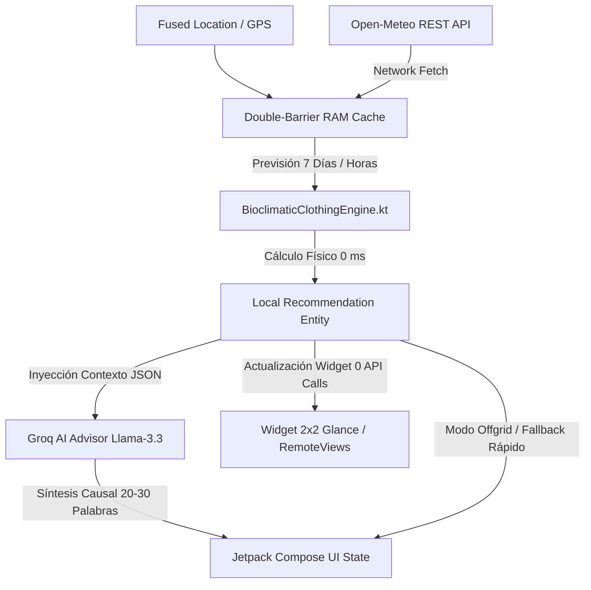

# 🌤️ Easy-Climate: Engine Bioclimático + IA Local-First para Recomendación de Vestimenta

[](https://kotlinlang.org)
[](https://developer.android.com/jetpack)
[](https://open-meteo.com/)
[](https://groq.com/)
[](https://developer.android.com/jetpack/compose/glance)
[](https://nothing.tech)

---

## 📌 1. Introducción y Propósito del Proyecto

Las aplicaciones meteorológicas convencionales informan la temperatura termométrica ($^\circ\text{C}$) o la sensación térmica estática, pero **fracasan al responder la pregunta fisiológica fundamental: *«¿Qué debo ponerme hoy para estar cómodo y proteger mi salud?»***.

**Easy-Climate** resuelve la brecha entre la meteorología física y la fisiología humana mediante una arquitectura híbrida **Local-First + LLM Bioclimático**. Diseñada con especial atención a perfiles de alta transpiración y sensibilidad respiratoria (prevención de broncoconstricción inducida por frío/asma y enfriamiento por sudor frío), la aplicación analiza variables termodinámicas en tiempo real (humedad relativa, punto de rocío, irradiancia solar, convección urbana y gradientes térmicos vespertinos) para generar recomendaciones precisas de vestimenta, calzado y estrategia de capas (*layering*).

---

## 🏗️ 2. Arquitectura del Sistema (Hybrid Local-First + LLM)

Easy-Climate implementa un flujo unidireccional desacoplado que garantiza **cero latencia de renderizado (0 ms en memoria RAM)**, resiliencia total fuera de línea (*offgrid*) y llamadas mínimas optimizadas a redes y APIs de inferencia.

### Diagrama de Flujo de Datos



### 🛡️ Caché de Doble Barrera en RAM (`Double-Barrier Cache`)
Para evitar saturación de red y consumo innecesario de batería en segundo plano mediante `WorkManager`, el repositorio gestiona un sistema de invalidación multicriterio:

1. **Barrera Temporal ($TTL = 30\text{ min}$):** Los datos en memoria no se reconsultan si la antigüedad es inferior a 30 minutos, salvo que ocurra una invalidación física.
2. **Barrera Espacial ($\Delta\text{Distancia} \ge 2\text{ km}$):** Utilizando la fórmula del semiverseno (*Haversine*), las consultas GPS no invalidan la caché a menos que el usuario se haya desplazado más de 2 kilómetros.
3. **Barrera Térmica ($\Delta T \ge \pm 3^\circ\text{C}$ o Cambio de Estado WMO):** Si el sensor o la estación reporta una oscilación repentina de temperatura o paso directo de seco a lluvia, la caché se invalida inmediatamente.

### ⚡ Modo Zero-Cost / Offgrid
- **Previsión a 7 Días:** Se computa al 100% en memoria RAM local mediante `BioclimaticClothingEngine.processSevenDayForecast()` con un coste de cómputo $< 0.1\text{ ms}$ por día, sin realizar llamadas HTTP adicionales a la IA.
- **Widgets de Escritorio:** Los ciclos periódicos del widget o reactivación por reinicio (`BootCompletedReceiver`) evalúan el motor físico local sin incurrir en costes de API de inferencia.

---

## ⚙️ 3. Motor Bioclimático Local (`BioclimaticClothingEngine.kt`)

El núcleo de cálculo físico implementa modelos matemáticos bioclimáticos rigurosos:

### A. Tasa de Evaporación y Punto de Rocío ($T_d$)
Se calcula la presión de vapor de saturación $E_s(T)$ mediante la **Ecuación de Magnus-Tetens** y la presión de vapor actual $E(T, \text{HR})$:

$$E_s(T) = 6.112 \cdot \exp\left(\frac{17.67 \cdot T}{T + 243.5}\right)$$

$$E(T, \text{HR}) = E_s(T) \cdot \left(\frac{\text{HR}}{100}\right)$$

$$T_d = \frac{243.5 \cdot \ln\left(\frac{E}{6.112}\right)}{17.67 - \ln\left(\frac{E}{6.112}\right)}$$

- **Regla Estricta de Veto del Algodón:** Si $T_d \ge 16^\circ\text{C}$ o la humedad relativa $\text{HR} > 70\%$, el motor emite alerta de **Alta Capilaridad Mandatoria**, forzando el uso exclusivo de tejidos sintéticos microperforados o rejilla 3D (poliéster/poliamida) de secado rápido y prohibiendo el algodón absorbente.

### B. Convección Urbana y Wind Chill Pectoral
En entornos de cañón urbano (*Urban Street Canyons*), el viento se acelera por efecto Venturi:

$$V_{\text{urbano}} = V_{\text{estación}} \cdot 1.2$$

$$\text{WindChill} = 13.12 + 0.6215 \cdot T - 11.37 \cdot (V_{\text{urbano}})^{0.16} + 0.3965 \cdot T \cdot (V_{\text{urbano}})^{0.16}$$

$$\Delta T_{\text{viento}} = T - \text{WindChill}$$

- **Alerta de Protección Pectoral:** Si $\Delta T_{\text{viento}} \ge 3.0^\circ\text{C}$ o $V_{\text{urbano}} \ge 18\text{ km/h}$ con $T < 18^\circ\text{C}$, se activa el requerimiento mandatorio de **cortavientos cerrado y cuello alto** para proteger la zona torácica y prevenir espasmos bronquiales y crisis asmáticas.

### C. Factor de Mucosa Respiratoria
- **Condición:** Aire seco e invernal ($T \le 12^\circ\text{C}$ y $\text{HR} < 40\%$) o ráfagas de viento $\ge 20\text{ km/h}$.
- **Acción:** Recomienda braga técnica o cuello protector de tejido poroso para humidificar y atemperar el flujo de aire inhalado antes del contacto con las vías respiratorias bajas.

### D. Radiación Solar Directa y Estrategia Sol/Sombra
A partir de la cobertura de nubes ($C\%$) y la hora solar, se estima la irradiancia directa ($W/m^2$) y la ganancia térmica percibida:

$$\text{Ganancia Solar} = \Delta T_{\text{solar}} \in [+2^\circ\text{C}, +4^\circ\text{C}]$$

- **Estrategia Modular:** Recomienda prendas intermedias con cremallera frontal completa (*full-zip*) para disipar calor al caminar bajo radiación directa y abrochar rápidamente en zonas sombrías o de viento.

### E. Alerta de Caída Térmica Vespertina (*Sunset Drop*)
- **Detección:** Gradiente térmico al anochecer con descenso brusco ($> 5^\circ\text{C}$) o aproximación $T - T_d \le 2^\circ\text{C}$.
- **Efecto:** Alerta de **Sudor Frío**, recomendando llevar en mochila un cortavientos ligero para evitar que la humedad corporal acumulada se enfríe sobre la piel al caer el sol.

### F. Matriz de Aislamiento Térmico CLO
Estimación estandarizada del nivel de aislamiento según la temperatura operativa:

| Rango de Temperatura | Nivel CLO Requerido | Configuración Textil Típica |
| :--- | :--- | :--- |
| $\ge 26^\circ\text{C}$ | **0.3 – 0.4 CLO** | Tejido técnico ultraligero microperforado |
| $20^\circ\text{C} - 25^\circ\text{C}$ | **0.5 – 0.6 CLO** | Manga corta transpirable / Poliéster |
| $15^\circ\text{C} - 19^\circ\text{C}$ | **0.7 – 0.8 CLO** | Manga corta técnica + Cortavientos modular |
| $10^\circ\text{C} - 14^\circ\text{C}$ | **0.9 – 1.0 CLO** | Capa base + Sudadera técnica + Cortavientos cerrado |
| $< 10^\circ\text{C}$ | **1.1+ CLO** | Sistema multicapa térmico + Cortavientos estanco |

---

## 🧠 4. Integración del Asesor IA (`GroqBioclimaticAdvisor.kt`)

Cuando la conexión está disponible, los cálculos físicos se envían al modelo **Llama 3.3 70B Versatile** en **Groq Cloud** mediante un *System Prompt* causal y riguroso.

### Inyección de Contexto JSON
```json
{
  "currentTemp": 20.4,
  "apparentTemp": 19.8,
  "humidity": 78,
  "dewPoint": 16.5,
  "urbanWindSpeed": 21.6,
  "deltaWindChill": 3.4,
  "solarGain": 3.0,
  "cloLevel": "0.6 CLO",
  "isHighSweatRisk": true,
  "isMandatoryChestProtection": true
}
```

### Directiva de Redacción Causal
El asesor IA no genera listas genéricas; sintetiza una recomendación estructurada en **español fluido y orgánico (20 a 30 palabras)** explicando la causa ambiental y la respuesta textil preventiva:
> *"Con 20°C y humedad alta (punto de rocío 16.5°C), usa camiseta técnica de secado rápido; el viento urbano de 21 km/h exige cortavientos abrochado para evitar enfriamiento pectoral."*

---

## 📱 5. Interfaz de Usuario y Widget de Escritorio

### Widget Nativo 2x2 (Jetpack Glance / RemoteViews)
Rediseñado bajo principios de diseño **Minimal & Glassmorphic**:
1. **Cabecera de Ubicación:** Soporte para nombres de municipios y distritos (`Delicias, Madrid`) con `maxLines = 1`, `ellipsize = "end"` a `14sp` y rango térmico $\uparrow\text{Max} \downarrow\text{Min}$ a la derecha.
2. **Temperatura y Estado:** Tipografía central a `32sp` con descripción climática a `12sp` sin truncamientos.
3. **Fila de Métricas Secundarias:** Muestra en una única línea compacta `Sens. 20° · 💧 28% · 💨 17 km/h`.
4. **Bloque Destacado Bioclimático:** Contenedor redondeado (`CornerRadius 14dp`) con icono de vestimenta prominente (`👕`, `🧥`, `🎽`, `🛡️`), resumen de 3-5 palabras (`maxLines = 2`) y badge del origen (`✨ Groq` o `⚙️ Local`).

### ⚪ Compatibilidad con Nothing OS & Material You
- **Vector Monocromo (`res/drawable/ic_launcher_monochrome.xml`):** Silueta vectorial 100% blanca sólida sobre fondo transparente, respetando el área de seguridad central de **66x66 dp** dentro del lienzo de **108x108 dp**.
- **Adaptative Icon XML (`ic_launcher.xml`):**
```xml
<?xml version="1.0" encoding="utf-8"?>
<adaptive-icon xmlns:android="http://schemas.android.com/apk/res/android">
    <background android:drawable="@color/ic_launcher_background" />
    <foreground android:drawable="@drawable/ic_launcher_foreground" />
    <monochrome android:drawable="@drawable/ic_launcher_monochrome" />
</adaptive-icon>
```

---

## 🛠️ 6. Guía de Instalación, Compilación y Configuración

### Prerrequisitos
- **Android Studio:** Ladybug (2024.2.1) o superior.
- **JDK:** OpenJDK 17+.
- **Android SDK:** `minSdk = 26`, `targetSdk = 35`, `compileSdk = 35`.

### Configuración de Credenciales
Para habilitar el Asesor IA en tiempo real, añade tu API Key de Groq en el archivo `.env` o en el panel de secretos de compilación:
```properties
GROQ_API_KEY=gsk_tu_api_key_aqui
```

### Comandos de Compilación y Verificación
```bash
# Compilar el APK en modo depuración
gradle assembleDebug

# Ejecutar las pruebas unitarias en la JVM local (Robolectric / JUnit)
gradle :app:testDebugUnitTest

# Verificar linting y consistencia de recursos
gradle lintDebug
```

---

## 📄 Licencia

Proyecto distribuido bajo la licencia MIT. Diseñado con rigor técnico para maximizar el confort y la salud fisiológica frente a cualquier condición meteorológica.
