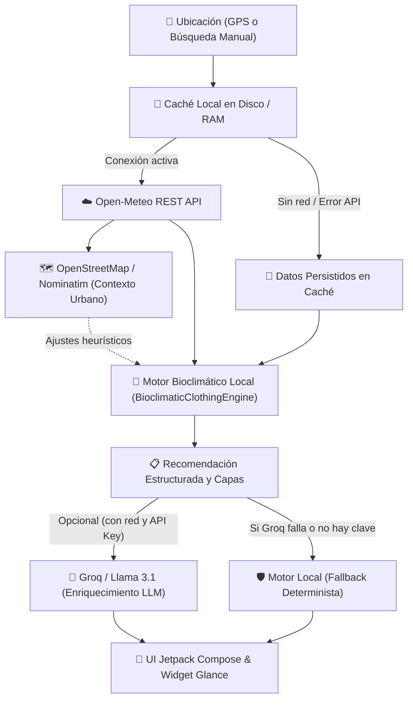

<p align="center">
  <h1 align="center">Easy-Climate</h1>
  <p align="center">
    <strong>Motor bioclimático para Android y asistente inteligente de vestimenta, confort térmico y protección ambiental.</strong>
  </p>
  <p align="center">
    <i>«Analizar variables complejas en el dispositivo; presentar solo decisiones claras al usuario.»</i>
  </p>
</p>

<p align="center">
  
  
  
  
  
  
</p>

---

## 📌 ¿Qué es Easy Climate?

**Easy-Climate** es una aplicación nativa de Android diseñada para transformar datos meteorológicos crudos en **decisiones accionables sobre vestimenta, calzado y confort personal**.

En lugar de limitarse a mostrar una lista de números (temperatura, porcentaje de humedad, velocidad de viento o milímetros de agua), Easy Climate **interpreta internamente la combinación bioclimática** de los factores atmosféricos:

* **Térmico real vs. percibido:** Calcula la interacción entre temperatura ambiental, humedad relativa (presión de vapor de agua), viento aparente e inercia solar directa frente a sombra.
* **Evolución temporal:** Evalúa oscilaciones térmicas diurnas y cambios bruscos de temperatura entre el momento de salida y el regreso.
* **Estrategia textil modular:** Propone una configuración basada en el **método de las tres capas** (capa base transpirable, capa intermedia térmica y capa exterior cortavientos o impermeable).
* **Ausencia de contradicciones:** Aplica umbrales estrictos de decisión: no recomienda paraguas ante un 5 % de lluvia ni abrigo con 21 °C, evitando generar ruido innecesario o alertas injustificadas.

> **Aviso de salud:** Las recomendaciones proporcionadas tienen carácter informativo y de confort térmico cotidiano; no constituyen consejo médico ni sustituyen pautas clínicas profesionales.

---

## 🏛️ Jerarquía de Información (Priorización por 4 Niveles)

Easy Climate sigue una estricta jerarquía en su interfaz visual para garantizar que la pantalla principal permanezca despejada y centrada en lo crucial:

| Nivel | Categoría | Contenido | Comportamiento en UI |
| :---: | :--- | :--- | :--- |
| **1** | **Decisión Inmediata** | Situación actual, recomendación principal de vestimenta, evolución clave y alertas críticas. | **Destacado permanente** en el encabezado y tarjeta principal. |
| **2** | **Soporte de la Decisión** | Estrategia de capas (cebolla), tipo de calzado, complementos clave y balance Sol vs. Sombra. | Visible de forma limpia dentro de la tarjeta de recomendación. |
| **3** | **Información Contextual** | Lluvia (%), viento (km/h) y humedad (%). | **Discretas por defecto**. Se destacan automáticamente solo ante condiciones anómalas (rachas >30 km/h, lluvia activa o bochorno severo). |
| **4** | **Información Técnica** | Calidad del aire (AQI europeo), ciclo solar (horas de luz), carrusel horario completo y previsión a 7 días. | Organizadas en módulos inferiores desplegables y de lectura secundaria. |

---

## ⚙️ Capacidades Principales del Motor

### 1. Motor Bioclimático en el Dispositivo (`BioclimaticClothingEngine`)
* **Sensación térmica combinada:** Evalúa la temperatura aparente psicrométrica según la fórmula australiana de Steadman ajustada a entornos urbanos.
* **Inercia solar prudente (Sol vs. Sombra):** Modela la ganancia térmica por radiación solar directa ($+0.0$ a $+3.0$ °C) en función del índice UV real y la cobertura de nubes, evitando proyecciones de falsa precisión.
* **Fenómenos bioclimáticos detectados:**
  * **Frío calado:** Humedad $>75\ \%$ con $T \le 13\ ^\circ\text{C}$ (conducción térmica acelerada; requiere protección exterior impermeable/cortavientos).
  * **Bochorno:** Humedad $>70\ \%$ con $T \ge 24\ ^\circ\text{C}$ (dificultad de evaporación del sudor; requiere fibras naturales transpirables).
  * **Oscilación térmica alta:** Variación $\ge 7\ ^\circ\text{C}$ durante la jornada (recomienda prendas modulares fáciles de quitar).

### 2. Personalización Discreta
Sin sobrecargar la interfaz principal con controles invasivos, Easy Climate permite adaptar las recomendaciones mediante selectores compactos:
* **Sensibilidad térmica:** Caluroso ($+2\ ^\circ\text{C}$ de compensación metabólica), Normal ($0\ ^\circ\text{C}$) o Friolero ($-2\ ^\circ\text{C}$ percibidos).
* **Tipo de actividad:** A pie (estándar), Bicicleta/Patinete (añade $+12\ \text{km/h}$ de viento relativo frontal para aconsejar cortavientos) o Transporte motorizado.
* **Ventana real de salida:** Selección de hora de salida y hora de regreso para analizar exclusivamente las condiciones térmicas de dicho intervalo (p. ej., salida templada a las 15:00 y regreso frío a las 22:00).
* **Duración:** Salida corta (1 hora), media jornada (2–4 horas) o jornada completa.

### 3. Predicciones y Tendencias Interdiarias
* **Distinción nítida:** Diferencia explícita entre condiciones actuales medidas, evolución horaria a corto plazo y previsiones semanales.
* **Lenguaje probabilístico:** No presenta los modelos meteorológicos como certezas absolutas.
* **Tendencias fundamentadas:** Genera resúmenes de tendencia únicamente si la variación interdiaria es notable:
  * *«📉 Mañana refresca unos 3 °C respecto a hoy.»* (si $|\Delta T| \ge 2.5\ ^\circ\text{C}$).
  * *«📉 Descenso progresivo de temperaturas durante los próximos días.»* (si se verifica una caída sostenida durante 3 o más días consecutivos).

### 4. Widget de Escritorio Adaptativo
* Desarrollado con **Jetpack Glance**.
* Ajusta su paleta de color y contraste dinámicamente según la franja horaria solar (amanecer, día, atardecer y noche).
* Tareas de sincronización periódica en segundo plano orquestadas mediante `WorkManager`.

---

## 🔄 Arquitectura y Flujo de Datos

El sistema implementa una arquitectura **Offline-First** y **Tolerante a Fallos**:



### Mecanismos de Redundancia y Fallback
1. **Fallo de Groq:** Si el servicio de IA devuelve error (HTTP 400, límite de cuota o falta de API key), el motor local asume instantáneamente la síntesis en lenguaje natural (< 1 ms de latencia en RAM).
2. **Fallo de la API meteorológica:** Si Open-Meteo no responde o el dispositivo no tiene red, se recupera el último estado válido guardado en `SharedPreferences` / almacenamiento local y se muestra el indicador `Modo sin conexión · Datos en caché`.
3. **Datos parciales:** Si algún parámetro secundario (ráfagas, UV o viento) viene nulo de la estación meteorológica, el motor aplica valores defensivos sin arrojar excepciones ni inventar datos.

---

## 🛠️ Tecnologías y Dependencias

* **Lenguaje:** [Kotlin 2.x](https://kotlinlang.org/) con Kotlin Symbol Processing (KSP).
* **Interfaz de Usuario:** [Jetpack Compose](https://developer.android.com/jetpack/compose) con Material Design 3 y gráficos reactivos en `Canvas`.
* **Asincronía & Flujo reactivo:** Kotlin Coroutines y `StateFlow` / `SharedFlow`.
* **Red y Serialización:**
  * [Retrofit 2](https://square.github.io/retrofit/) & [OkHttp 3](https://square.github.io/okhttp/).
  * [Moshi](https://github.com/square/moshi) con generador de adaptadores KSP.
* **Persistencia & Background:**
  * AndroidX `Room` y `SharedPreferences`.
  * AndroidX `WorkManager` para actualizaciones programadas.
* **Widget:** AndroidX `Glance` (interfaz declarativa para widgets de inicio).
* **Localización:** Google Play Services Location API & OpenStreetMap Nominatim.
* **Modelos de Lenguaje (Opcional):** Groq Cloud API (Llama 3.1) / Google Gemini API.

---

## 📂 Estructura del Código Fuente

```text
app/src/main/java/com/example/
├── MainActivity.kt                      # Punto de entrada de la actividad principal Compose
├── data/
│   ├── api/
│   │   ├── ApiClient.kt                 # Cliente OkHttp y servicios Retrofit
│   │   ├── WeatherApiService.kt         # Endpoints de Open-Meteo
│   │   └── NominatimService.kt          # Geocodificación inversa con OpenStreetMap
│   ├── models/
│   │   └── WeatherModels.kt             # Modelos de datos meteorológicos y preferencias
│   └── repository/
│       └── WeatherRepository.kt         # Orquestador de red, caché local y fallbacks
├── engine/
│   ├── BioclimaticClothingEngine.kt     # Motor local de recomendación de capas y calzado
│   ├── BioclimaticMathEngine.kt         # Cálculo de índices físicos (Humidex, rocío, radiación)
│   ├── MicroclimateAdjuster.kt          # Heurísticas de entorno urbano
│   ├── GroqBioclimaticAdvisor.kt        # Cliente de síntesis con Groq LLM (opcional)
│   └── GeminiBioclimaticAdvisor.kt      # Integración complementaria de IA
├── ui/
│   ├── components/
│   │   ├── BioclimaticRecommendationCard.kt # Tarjeta principal de decisión y capas
│   │   ├── AtmosphericWeatherBackground.kt  # Fondo procedural animado en Canvas
│   │   ├── HourlyCarousel.kt                # Carrusel de previsión horaria
│   │   ├── DailyAccordion.kt                # Acordeones de pronóstico a 7 días
│   │   ├── GlassComponents.kt               # Contenedores con estética glassmorphic
│   │   └── WeatherIcons.kt                  # Renderizado de iconografía meteorológica
│   ├── screens/
│   │   ├── WeatherScreen.kt                 # Pantalla principal completa
│   │   └── DevToolsAdminPanel.kt            # Panel de telemetría y pruebas de red
│   ├── theme/                               # Sistema de diseño M3, tipografía y paleta
│   └── viewmodel/
│       └── WeatherViewModel.kt              # Estado UI unidireccional (UDF)
├── utils/
│   ├── DevToolsTelemetry.kt             # Métricas de latencia y estado offline
│   └── WeatherUtils.kt                  # Formateadores de fecha, hora y coordenadas
└── widget/
    ├── WeatherWidgetProvider.kt         # Definición del widget de escritorio Glance
    ├── WidgetTimeTheme.kt               # Paleta horaria del widget
    ├── LocationTrackingManager.kt       # Gestión de ubicación para el widget
    └── worker/
        ├── WeatherUpdateWorker.kt       # Tarea en segundo plano de WorkManager
        └── WeatherWorkScheduler.kt      # Programación de refrescos periódicos
```

---

## 🚀 Compilación y Despliegue

### Prerrequisitos
* **Android Studio:** Ladybug (2024.2.1) o superior.
* **JDK:** OpenJDK 17 o 21 configurado en el entorno.
* **Android SDK:**
  * `minSdk`: 24 (Android 7.0)
  * `targetSdk`: 36 (Android 15)
  * `compileSdk`: 36

### Comandos de Construcción

Compilar el APK de depuración:
```bash
./gradlew assembleDebug
```

Ejecutar las pruebas unitarias locales en JVM:
```bash
./gradlew :app:testDebugUnitTest
```

Generar el paquete de publicación (Android App Bundle - AAB):
```bash
./gradlew bundleRelease
```

---

## 🔑 Configuración de Credenciales Opcionales

Easy Climate funciona al 100 % de forma determinista y autónoma mediante su motor local sin necesidad de claves de terceros. Si se desea habilitar la síntesis avanzada en lenguaje natural con Groq:

1. Cree un archivo `.env` en la raíz del proyecto (basado en `.env.example`).
2. Declare la clave de API:
   ```properties
   GROQ_API_KEY=gsk_tu_clave_de_groq_aqui
   ```
3. El plugin de Secretos de Gradle inyectará la variable de forma segura en `BuildConfig.GROQ_API_KEY`.

> **Seguridad:** No suba archivos `.env` con credenciales reales a repositorios públicos.

---

## 🔒 Privacidad y Permisos

* **Permisos de Localización (`ACCESS_COARSE_LOCATION` / `ACCESS_FINE_LOCATION`):** Utilizados exclusivamente para consultar la previsión del punto geográfico del usuario. Si el usuario rechaza los permisos, la aplicación permanece completamente funcional mediante búsqueda manual de municipios.
* **Transmisión de Coordenadas:** Las coordenadas se remiten únicamente a las APIs públicas de Open-Meteo y OpenStreetMap conforme a sus políticas de uso. No se almacena historial de geolocalización en servidores externos.
* **Uso de IA:** Cuando Groq está activo, únicamente se envían resúmenes numéricos de clima (temperatura, viento, etc.) para formular la redacción del consejo; nunca se transmiten datos de identificación personal del usuario.

---

## 📄 Licencia

Este proyecto se distribuye bajo la licencia **MIT**. Para consultar los términos y condiciones completos, revise el archivo [LICENSE](LICENSE).
